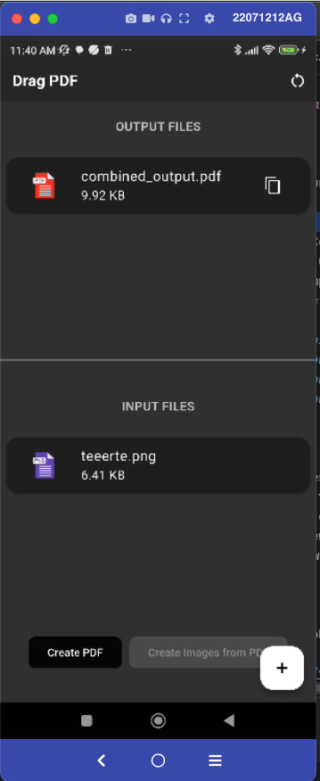

# 📄 Welcome to Drag PDF!

**Drag PDF** is your all-in-one solution for creating and combining PDFs with ease. Whether you're merging multiple documents or building a brand-new PDF from images and other files, we've got you covered.

## 🚀 What You Can Do:
- **Merge PDFs**: Combine multiple PDF files into a single, organized document.
- **Create PDFs**: Generate new PDFs from images, existing PDFs, or a mix of both.
- **Drag & Drop Simplicity**: Just upload your files and let PDF Fusion do the rest.
- **Fast & Secure**: Your files are processed quickly and safely, with your privacy in mind.

 

## 💡 Get Started
1. Upload your files (PDFs, images, or both).
2. Arrange them in the order you want.
3. Click **Merge** or **Create**.

4. Download your new PDF!  vicajilau/Drag-PDF
   👉 Go to the download page 

<!DOCTYPE html>
<html lang="es">
<head>
    <meta charset="UTF-8">
    <meta name="viewport" content="width=device-width, initial-scale=1.0">
</head>
<body>
<h1>Descargar App Flutter</h1>

Seleccione su sistema operativo para descargar la aplicación:

    &nbsp;&nbsp;&nbsp;&nbsp;&nbsp;&nbsp;&nbsp;&nbsp;
    &nbsp;&nbsp;&nbsp;&nbsp;&nbsp;&nbsp;&nbsp;&nbsp;
    &nbsp;&nbsp;&nbsp;&nbsp;&nbsp;&nbsp;&nbsp;&nbsp;
    &nbsp;&nbsp;&nbsp;&nbsp;&nbsp;&nbsp;&nbsp;&nbsp;
    &nbsp;&nbsp;&nbsp;&nbsp;&nbsp;&nbsp;&nbsp;&nbsp;
     

</body>
</html>

If you have any problem using the library, you have available our github repository to add a new issue or if you have any proposal, i,ll invite you to doing a pull request with your changes

https://github.com/vicajilau/Drag-PDF

Thanks for choosing **Drag PDF** — where your documents come together seamlessly!
